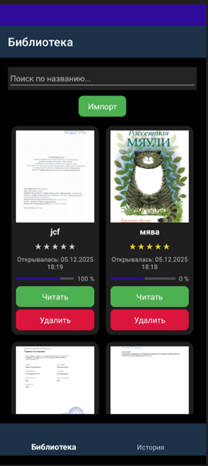
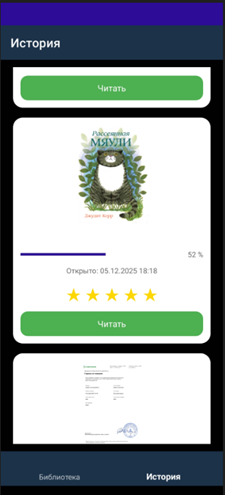

<!-- Хедер с анимацией и бешеным градиентом -->
<div align="center">

<!-- Анимированный заголовок с эффектом печати -->
<h1 align="center">
  
</h1>

<!-- Бешеные бейджи -->
<p align="center">
  
  
  
  
  
</p>

<!-- Анимированный разделитель -->


<!-- Демо гифка или скриншоты -->
<p align="center">
  
  
</p>

<!-- Кнопки действий -->
<p align="center">
  <a href="https://github.com/ваш-username/Ebook/releases">
    
  </a>
 
</p>

</div>

---

## 🔥 **ЧТО ЭТО ЗА БЕШЕНСТВО?**

**Ebook** — это не просто читалка PDF. Это **твой личный цифровой сейф для мозга**, где каждая книга получает звёзды, историю и душу. Приложение, которое превращает хаос PDF-файлов в упорядоченную вселенную знаний.

> ⚡ **Создано по ГОСТ 19.201-78, но душой — для тебя.**

---

## 🚀 **ФИЧИ, ОТ КОТОРЫХ ВЗОРВЁТСЯ МОЗГ**

### **🎯 ЯДРО ПРИЛОЖЕНИЯ**
| Функция | Что делает | Почему это ахуенно |
|---------|------------|-------------------|
| **📖 Умная библиотека** | Автоматическая организация PDF | Не ищи файлы — они сами тебя найдут |
| **⭐ Система рейтинга** | Оценка книг от 1 до 5 звёзд | Помнишь, что было круто, а что — нет |
| **🕒 История чтения** | Точное время открытия каждой книги | Знаешь, когда в последний раз прокачивал мозг |
| **📊 Прогресс чтения** | Процент прочтения для каждой книги | Видишь свой путь к гениальности |
| **🔍 Поиск по названию** | Мгновенный поиск в библиотеке | Находи нужное за 0.5 секунды |

### **🎨 ИНТЕРФЕЙС — КАК ШЁЛК**
- **Адаптивная сетка/список** — смотри книги как хочешь
- **Сенсорная навигация** — интуитивно, без инструкций

---

## 📱 **СКРИНШОТЫ**

<div align="center">

### **📚 ЭКРАН БИБЛИОТЕКИ**
<!-- ВСТАВЬ СВОЙ СКРИНШОТ image.png СЮДА -->

*Твои книги, твой порядок. Импорт из памяти, оценка, удаление — всё под контролем.*

### **🕰️ ЭКРАН ИСТОРИИ**
<!-- ВСТАВЬ ВТОРОЙ СКРИНШОТ СЮДА -->

*Всё, что ты читал. Когда начал, сколько прошёл, как оценил. История твоего роста.*

</div>

---

## 🛠️ **ТЕХНОЛОГИЧЕСКИЙ СТЕК**

<div align="center">

| Слой | Технологии | Зачем |
|------|------------|-------|
| **🎭 Фронтенд** | .NET MAUI, C#, XAML | Нативные контроллы, плавная анимация |
| **📱 Платформа** | Android 8.0+ (API 26) | Работает даже на старых девайсах |
| **⚙️ Разработка** | Visual Studio 2022 | Индустриальный стандарт качества |
| **📦 Хранение** | SQLite + System.IO | Быстро, надёжно, без интернета |
| **🎨 Дизайн** | Material Design 3 | Современно, стильно, удобно |

</div>

---

## ⚡ **ТРЕБОВАНИЯ К ЖЕЛЕЗУ**

| Компонент | Минимум | Рекомендуется |
|-----------|---------|---------------|
| **Процессор** | 1 ГГц | 2+ ГГц (для плавности) |
| **ОЗУ** | 2 ГБ | 4 ГБ (для тяжёлых PDF) |
| **Память** | 100 МБ свободно | 1 ГБ (под библиотеку) |
| **Экран** | 720×1280 | 1080×1920 (для комиксов) |
| **ОС** | Android 8.0 | Android 13+ |

> 💡 **Проверено на:** Xiaomi Redmi Note, Samsung Galaxy, эмуляторах Android Studio

---

## 🚀 **УСТАНОВКА И ЗАПУСК**

### **📲 Для пользователей:**
```bash
1. Качай APK из Releases
2. Разреши установку из неизвестных источников
3. Запускай и начинай читать
